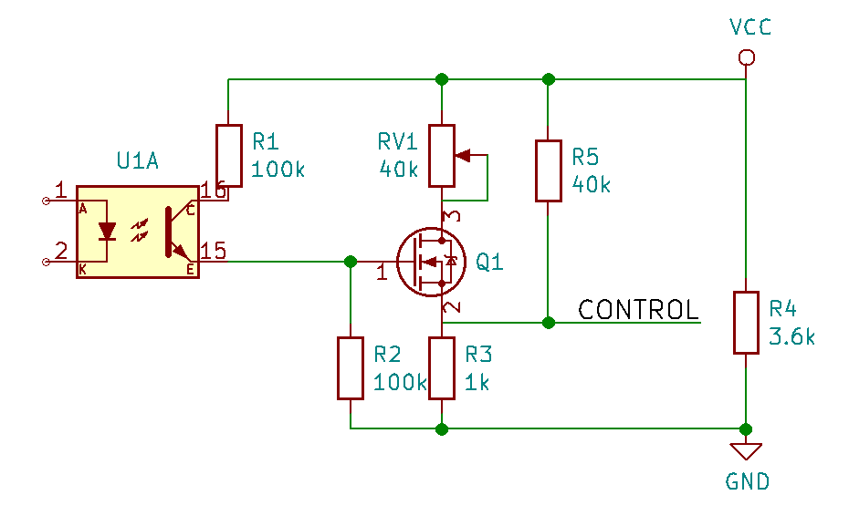

#Gazo pedalo hackas

##Faktai apie gazo pedalą
 
 * Egzistuoja SPDT jungiklis, kuris laiko užtrumpintus Juodą/Raudoną laidus, kol pedalas nenuspaustas ir Juodą/Mėlyną, kai nuspaustas. Perėjimas iš vienos būsenos į kitą turi būti "greitas", kitaip metama klaida **C4** - pedalo mygtuko klaida.
 * Egzistuoja potenciometras, sukiojamas pedalu jį spaudžiant. Potenciometro bendra varža - 3,6k, wiperio varža nuo potenciometro galų keičiasi 4,6k - 3,7k nuo "aukštojo" galo ir 1,2k - 2,12k nuo "žemojo" galo. Išvada - tai 3,6k potenciometras su 1k rezistoriumi ant išėjimo.
 * Į potenciometrą Žaliu laidu paduodama 10V įtampa, greičiausiai nuosekliai yra pajungtas 500 Omų rezistorius, nes pajungus potenciometrą ant Žalio laido įtampa pasikeičia į 8,7V
 * Keltuvas tikisi, kad potenciometras bus pajungtas ir ant Geltono laido bus ~8,7V, kitaip metama klaida **C6**
 * Kai pedalas nepaspaustas, keltuvas tikisi, kad ant Raudono laido (potenciometro wiperio) bus apie 0,22V, min 0,08V, jei Raudonas laidas paliekamas plaukiot arba pajungiamas prie potenciometro GND, metama klaida **C6**
 * Kai pedalas pilnai paspaustas, ant wiperio būna 2,36V
 * "Iš jausmo", atrodo, kad mums pilnai užtektų greičio ant wiperio esant 0,5V

##Hacko strategija:

  * Užtrumpinti mygtuko Juodą ir Raudoną laidus
  * Mygtuko laidų konfigūraciją perjunginėti rele, kad būtų "greitai"
  * Tarp Žalio ir Geltono laido pastatyti 3,6k rezistorių
  * Ant potenciometro Raudono laido paduoti valdančią įtampą referencintą nuo Geltono laido

##Galvaniškai atsietas Hackas

R4 apsimeta, kad pedalo potenciometras yra pajungtas, R5 ir R3 sukuria valdymo įtampą, imituojančią "nepaspaustą" pedalą. Per optoporą įjungus tranzistorių Q1, potenciometras RV1 pajungiamas lygiagrečiai su R5 tokiu būdu pakeliant valdymo įtampą. R2 pririša Q1 užtūrą, kad jis atsitiktinai nesijunginėtų. R1 ir R2 sudaro daliklį, kuris apsaugo Q1 užtūrą nuo viršįtampio.